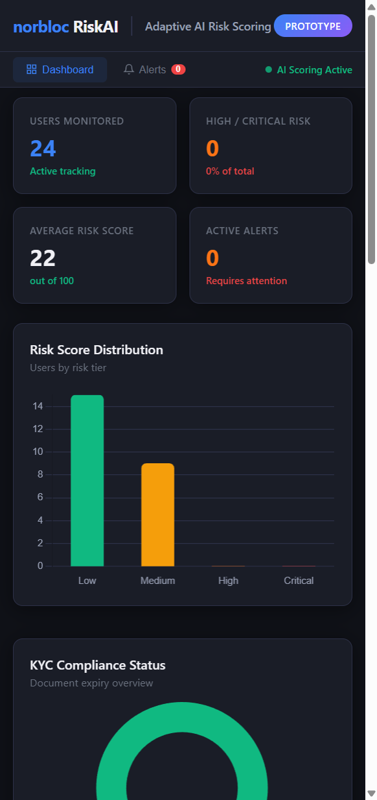
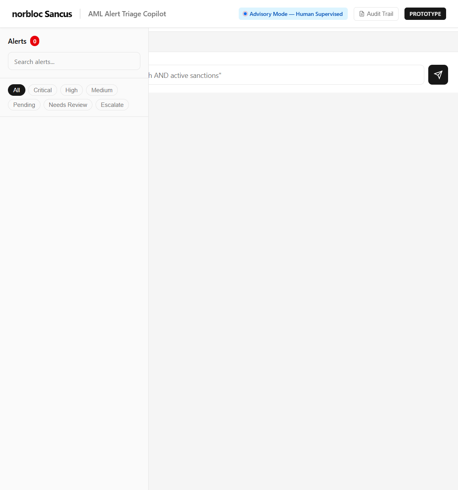
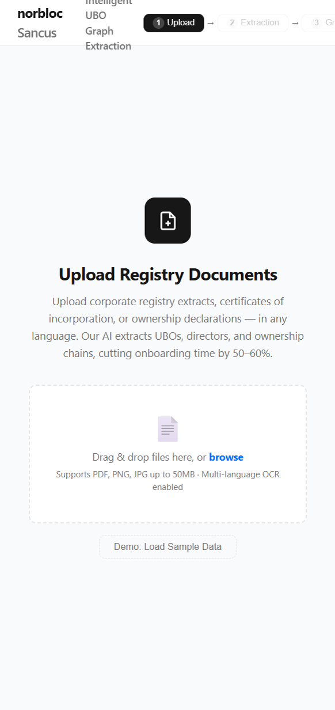

# Norbloc AI Engineering Assignment

> Interactive prototypes demonstrating AI-powered features for financial crime compliance


## Overview

This assignment delivers three interactive, single-file HTML prototypes for **norbloc** -- a financial crime compliance platform specializing in AML (Anti-Money Laundering), KYC (Know Your Customer), and sanctions screening. Each prototype demonstrates AI-assisted capabilities for key compliance workflows:

1. **Adaptive AI Risk Scoring** -- Dynamic customer risk assessment dashboard
2. **AML Alert Triage Copilot (Sancus)** -- AI-powered investigation assistant
3. **Intelligent UBO Graph Extraction** -- Interactive ownership structure visualization

## Quick Start

No build tools or dependencies required. Each prototype is a self-contained HTML file.

### Option 1: Open Directly

```
Double-click any `.html` file to open it in your browser.
```

### Option 2: Serve via Local HTTP Server

```bash
cd norbloc-assignment
python -m http.server 8765
```

Then visit:

| Prototype | URL |
|-----------|-----|
| Risk Scoring | http://localhost:8765/risk-scoring-prototype.html |
| AML Copilot | http://localhost:8765/aml-alert-triage-copilot.html |
| UBO Graph | http://localhost:8765/ubo-graph-extraction-prototype.html |

---

## Prototype 1: Adaptive AI Risk Scoring

A customer risk scoring dashboard that dynamically assesses and visualizes financial crime risk across a customer portfolio.



### Features

- **Risk Score Table** -- Sortable customer list with dynamic risk scores, trend indicators, and severity badges (Low / Medium / High / Critical)
- **Score Breakdown Charts** -- Chart.js line chart showing score evolution over time, donut chart for risk factor composition
- **KYC Status Tracking** -- Visual indicators for document validity (Valid / Expiring / Expired)
- **Alert Volume Dashboard** -- Time-series visualization of alert trends and distribution by severity
- **User Detail Drill-Down** -- Click any customer to see their full risk profile, historical scores, and contributing factors
- **Filtering & Search** -- Filter by risk level, search by name, sort by any column

### Key Design Decisions

- Risk scores are computed from weighted factors (transaction patterns, jurisdiction risk, PEP status, sanctions proximity)
- Temporal scoring shows how risk evolves, not just a static point-in-time number
- Color-coded badges provide at-a-glance risk assessment

---

## Prototype 2: AML Alert Triage Copilot (Sancus)

An AI assistant that helps compliance analysts investigate, triage, and resolve AML alerts through natural language interaction.



### Features

- **Alert Inbox** -- Sidebar listing 10 realistic AML alerts with severity indicators (critical, high, medium), customer info, and status badges
- **AI Chat Interface** -- Conversational investigation with structured AI responses including evidence, analysis, and recommendations
- **Evidence Graph** -- D3.js visualization showing entity relationships and transaction flows
- **Triage Summary** -- Structured output with recommended actions, risk factors, and escalation rationale
- **Transaction Timeline** -- Chronological view of suspicious transactions with amounts and counterparty details
- **Linked Alert Navigation** -- Jump between related alerts directly from the chat interface
- **Filtering** -- Filter alerts by severity (Critical / High / Medium) or status (Pending / Dismissed / Escalated)

### Alert Types Covered

| Alert ID | Type | Severity | Customer |
|----------|------|----------|----------|
| AML-001 | Sanctions Hit | Critical | Dmitri Volkov |
| AML-002 | Structuring | High | Li Wei |
| AML-003 | PEP Match | High | Senator Maria Santos |
| AML-004 | Rapid Movement | High | Olympus Trading FZE |
| AML-005 | Volume Spike | Medium | Ahmed Al-Rashid |
| AML-006 | Sanctions + Dormant | Critical | Elena Kuznetsova |
| AML-007 | Shell Company | Medium | Caribbean Holdings Ltd |
| AML-008 | Layering | High | Rajesh Patel |
| AML-009 | Cash-Intensive | Medium | Golden Dragon Casino Ltd |
| AML-010 | High-Risk Jurisdiction | High | Viktor Petrov |

---

## Prototype 3: Intelligent UBO Graph Extraction

An interactive visualization that extracts and displays Ultimate Beneficial Owner (UBO) ownership structures from unstructured corporate documents.



### Features

- **Force-Directed Graph** -- D3.js force simulation rendering entities (individuals, companies, trusts) and their ownership relationships
- **Node Interaction** -- Click any entity to view detailed information panel with ownership percentage, jurisdiction, and confidence score
- **Confidence Scoring** -- AI-extracted entities include confidence levels; filter by High (>90%), Medium (80-90%), or Low (<80%) confidence
- **Ownership Chains** -- Visualize multi-layer ownership structures including shell companies, nominees, and trusts
- **Entity Type Filtering** -- Filter by entity type (Individual, Company, Trust)
- **Verification Workflow** -- Mark entities as Verified or Flagged during investigation
- **Document Context** -- Side panel shows source document snippets that support each extracted relationship

### Entity Types

- **Individual** -- Natural persons with ownership stakes
- **Company** -- Corporate entities in the ownership chain
- **Trust** -- Trust structures with beneficiaries

---

## Architecture

### Design Philosophy

All prototypes follow a **zero-build, zero-dependency** approach:

- **Single HTML files** -- Each prototype is one self-contained file
- **No build tools** -- No npm, webpack, or transpilation required
- **CDN-hosted libraries** -- Only Chart.js and D3.js loaded from CDN
- **Dark theme** -- Consistent CSS custom property theming across all three prototypes

### Technical Stack

| Component | Technology |
|-----------|------------|
| Markup | HTML5 semantic elements |
| Styling | CSS3 with custom properties, flexbox, grid |
| Interactivity | Vanilla JavaScript (ES6+) |
| Charts | Chart.js 4.x |
| Graph Visualization | D3.js 7.x (force simulation) |
| Data | Embedded mock data (JSON) |

### Data Architecture

Each prototype uses realistic mock data:

- **Risk Scoring**: 10 customers with dynamic scores, 6 risk factors, 90-day history
- **AML Copilot**: 10 alerts across 7 alert types with 54 transactions, AI summaries, and evidence graphs
- **UBO Extraction**: 12-entity ownership graph with 15 directed ownership edges and confidence scores

---

## File Structure

```
norbloc-assignment/
├── risk-scoring-prototype.html       # Adaptive AI Risk Scoring dashboard
├── aml-alert-triage-copilot.html     # AML Alert Triage Copilot (Sancus)
├── ubo-graph-extraction-prototype.html # Intelligent UBO Graph Extraction
├── screenshots/
│   ├── risk-scoring-dashboard.png    # Risk scoring dashboard view
│   ├── aml-alert-triage-copilot.png  # AML copilot main interface
│   └── ubo-graph-extraction.png      # UBO graph visualization
└── README.md                         # This file
```

---

## Notes

- **Interview assignment** -- Built as a take-home technical assignment for norbloc
- **Not for production** -- Mock data, no backend, simulated AI responses
- **Browser support** -- Modern browsers (Chrome, Firefox, Safari, Edge)
